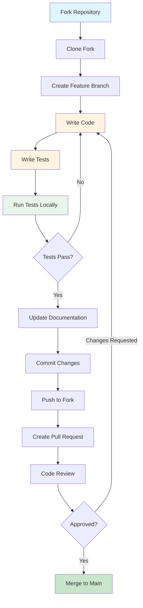

# Contributing to Kyros

Thank you for your interest in contributing to Kyros! This document provides guidelines for contributing to the project.

## Code of Conduct

Be respectful and professional in all interactions. We are committed to providing a welcoming and harassment-free experience for everyone.

## Development Setup

### Prerequisites

- C++17 compatible compiler (GCC 7+, Clang 5+, Apple Clang 10+, MSVC 2017+)
- CMake 3.15 or later
- Git for version control

### Initial Setup

```bash
# Fork the repository on GitHub, then clone your fork
git clone https://github.com/YOUR_USERNAME/kyros.git
cd kyros

# Add upstream remote
git remote add upstream https://github.com/original-org/kyros.git

# Build the project
./build.sh Debug

# Run tests to ensure everything works
cd build && ctest --output-on-failure
```

## Development Workflow



### Creating a Feature Branch

```bash
# Ensure your main branch is up to date
git checkout main
git pull upstream main

# Create a feature branch
git checkout -b feature/your-feature-name
```

### Making Changes

1. Write code following the project's style guidelines
2. Add or update tests for your changes
3. Update documentation as needed
4. Ensure all tests pass locally
5. Run code coverage to verify test completeness

```bash
# Build and test
./build.sh Debug --test

# Generate coverage report
./build.sh Coverage --coverage
```

## Code Style Guidelines

### Naming Conventions

- **Classes and Structs:** PascalCase (`ServerInterrogator`, `MCPServer`)
- **Functions and Methods:** snake_case (`detect_servers()`, `get_process_list()`)
- **Variables:** snake_case (`server_list`, `candidate_count`)
- **Constants:** UPPER_SNAKE_CASE (`MAX_TIMEOUT`, `DEFAULT_PORT`)
- **Private Member Variables:** trailing underscore (`platform_`, `config_`)
- **Namespaces:** lowercase (`kyros`, `kyros::detection`)

### File Organization

- One class per file (exceptions for small helper classes)
- Header guards: `KYROS_COMPONENT_NAME_HPP`
- Headers in `include/kyros/`, implementations in `src/`
- Keep public API minimal and well-documented

### Code Formatting

- Use 4 spaces for indentation (no tabs)
- Maximum line length: 100 characters
- Opening braces on same line for functions and control structures
- Use `auto` for complex types when type is obvious
- Prefer `std::optional` over raw pointers for optional values

### Best Practices

- **RAII:** Use RAII for resource management
- **Error Handling:** Use exceptions for exceptional conditions, `std::optional` for expected failures
- **Const Correctness:** Mark methods and parameters const when appropriate
- **Smart Pointers:** Use `std::unique_ptr` and `std::shared_ptr` appropriately
- **Modern C++:** Leverage C++17 features (structured bindings, std::optional, etc.)

### Example

```cpp
namespace kyros {

class ServerInterrogator {
public:
    ServerInterrogator(std::shared_ptr<PlatformAdapter> platform)
        : platform_(std::move(platform)) {}

    std::optional<MCPServer> interrogate(const Candidate& candidate);

private:
    std::shared_ptr<PlatformAdapter> platform_;

    bool send_request(const std::string& method);
};

} // namespace kyros
```

## Testing Requirements

### Test Coverage

- All new features must include comprehensive tests
- Maintain overall test coverage above 80%
- Aim for 90%+ coverage on critical components
- Test both success and failure paths

### Writing Tests

```cpp
#include <gtest/gtest.h>
#include <kyros/your_component.hpp>

TEST(ComponentTest, DescriptiveTestName) {
    // Arrange
    auto component = create_test_component();

    // Act
    auto result = component.perform_action();

    // Assert
    EXPECT_EQ(result.status, Status::Success);
    ASSERT_TRUE(result.data.has_value());
}
```

### Running Tests

```bash
# Run all tests
cd build && ctest --output-on-failure

# Run specific test
ctest -R test_scanner

# Run with verbose output
ctest --verbose

# Generate coverage report
./build.sh Coverage --coverage
```

## Documentation

### Code Documentation

- Document all public APIs with clear comments
- Explain complex algorithms and design decisions
- Include usage examples for non-trivial APIs
- Keep comments concise and up-to-date

### Project Documentation

When making changes that affect user-facing functionality:

- Update relevant documentation in `docs/`
- Update `CHANGELOG.md` with your changes
- Update usage examples in `README.md` if applicable
- Update the specification in `spec/Kyros.md` for architectural changes

## Pull Request Process

### Before Submitting

1. Ensure all tests pass: `cd build && ctest`
2. Verify code coverage: `./build.sh Coverage --coverage`
3. Build in Release mode: `./build.sh Release`
4. Update documentation as needed
5. Update CHANGELOG.md

### Submitting a Pull Request

1. Push your changes to your fork
2. Create a pull request against the upstream `main` branch
3. Fill out the pull request template with:
   - Clear description of changes
   - Motivation and context
   - Related issue numbers
   - Testing performed
   - Documentation updates

### Pull Request Guidelines

- Keep PRs focused on a single feature or fix
- Write clear, descriptive commit messages
- Respond to review feedback promptly
- Ensure CI/CD checks pass
- Rebase on main if conflicts arise

### Commit Message Format

```
<type>: <subject>

<body>

<footer>
```

**Types:**
- `feat`: New feature
- `fix`: Bug fix
- `docs`: Documentation changes
- `test`: Test additions or modifications
- `refactor`: Code refactoring
- `perf`: Performance improvements
- `build`: Build system changes

**Example:**
```
feat: Add SSE transport support

Implements Server-Sent Events transport for MCP servers.
Includes both detection and testing capabilities.

Closes #42
```

## Issue Reporting

### Bug Reports

When reporting bugs, include:

- Operating system and version
- Compiler and version
- Kyros version (`./build/kyros --version`)
- Command that triggered the bug
- Expected vs. actual behavior
- Full error output
- Steps to reproduce

### Feature Requests

When requesting features:

- Clear description of the proposed feature
- Use cases and motivation
- Potential implementation approach
- Impact on existing functionality

## Platform-Specific Development

### macOS

- Test using native Apple Clang compiler
- Verify process detection with `proc_pidinfo()`
- Test with System Integrity Protection (SIP) enabled

### Linux (Planned)

- Test on multiple distributions (Ubuntu, Fedora, Arch)
- Verify `/proc` filesystem access
- Test with different kernels

### Windows (Planned)

- Test with MSVC 2017+ and MinGW
- Verify Windows API usage
- Test on Windows 10 and 11

## Getting Help

- Check existing documentation in `docs/`
- Review similar code in the codebase
- Search existing issues and pull requests
- Open a discussion issue for questions
- Ask for clarification before starting large changes

## License

By contributing to Kyros, you agree that your contributions will be licensed under the MIT License.
