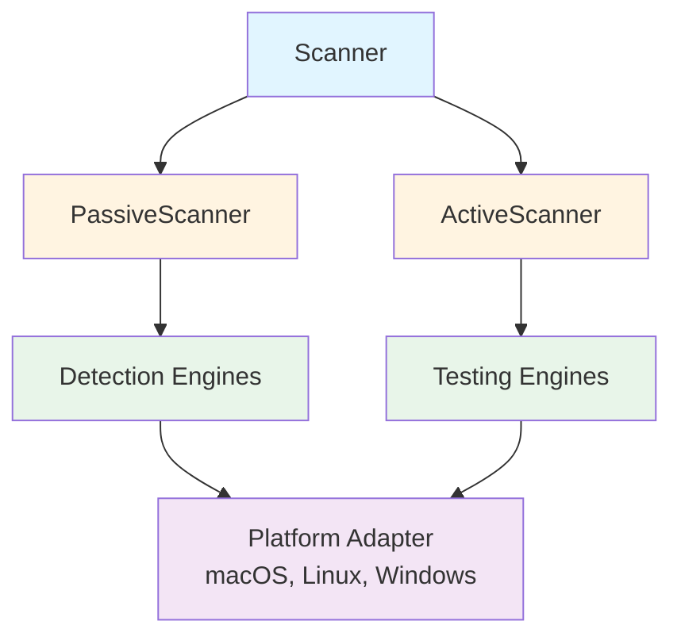
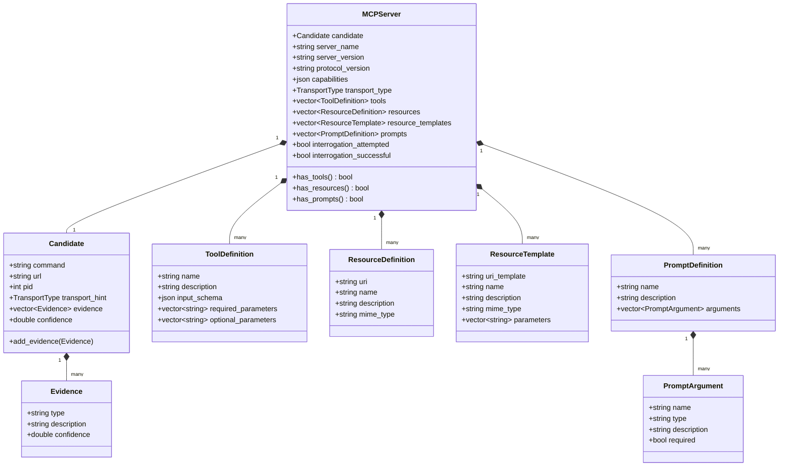
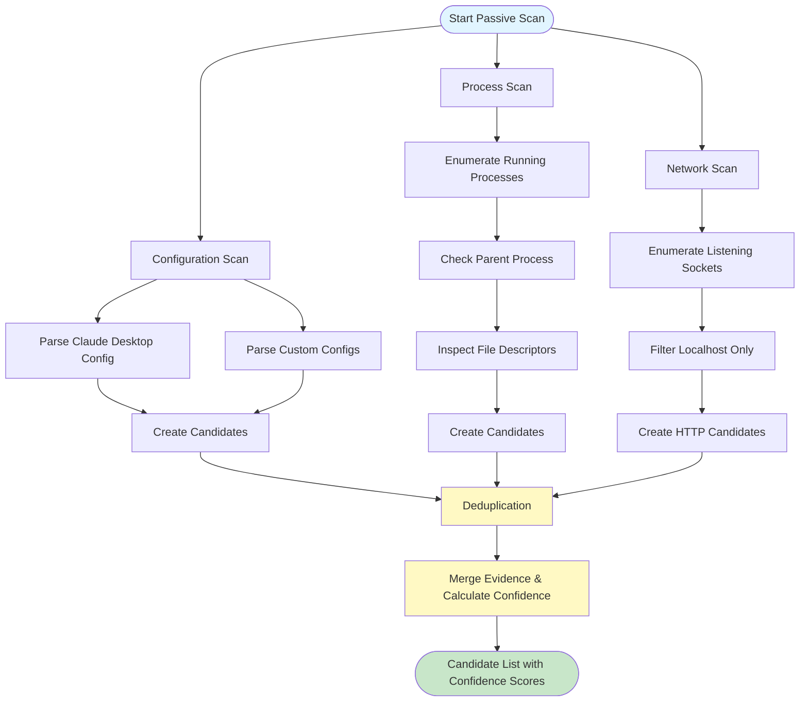
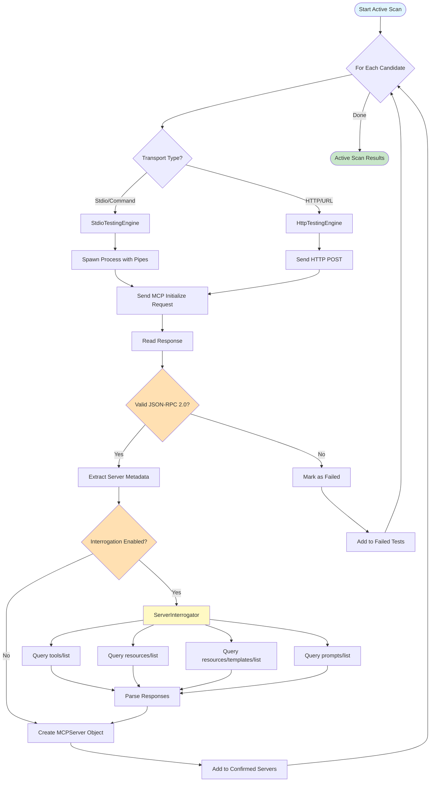
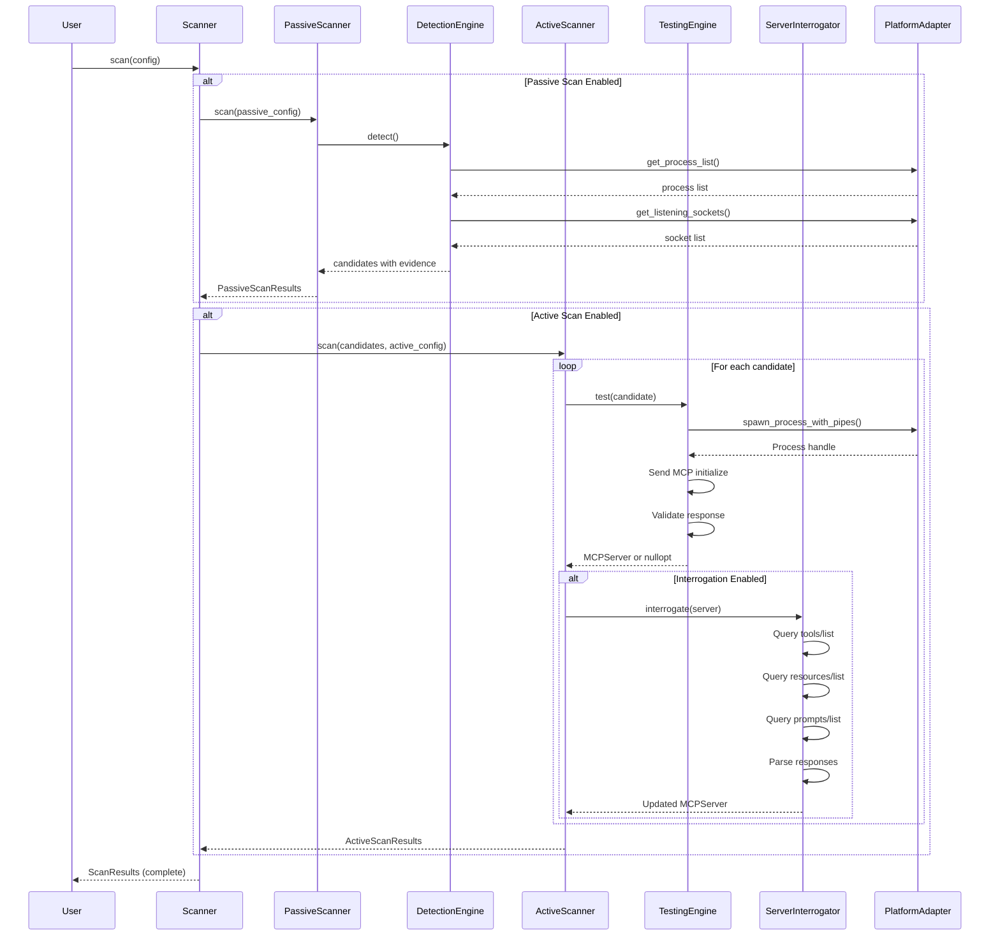

# Kyros Architecture

## Overview

Kyros is a Model Context Protocol (MCP) server discovery and interrogation tool. It employs a three-phase scanning approach: passive detection, active confirmation, and optional capability interrogation.

## System Architecture

## Core Components

### Scanner

The main orchestrator that coordinates passive detection and active testing phases.

**Responsibilities:**
- Execute scan workflow based on configuration
- Coordinate detection and testing engines
- Aggregate and deduplicate results
- Delegate reporting to ReportingEngine

**Key Methods:**
- `scan(ScanConfig)` - Main entry point for all scan operations

### PassiveScanner

Discovers potential MCP servers without active probing.

**Detection Engines:**
- `ConfigDetectionEngine` - Parses configuration files (Claude Desktop, custom configs)
- `ProcessDetectionEngine` - Identifies running MCP processes via parent process inspection and stdio pipe detection
- `NetworkDetectionEngine` - Discovers HTTP listeners on localhost
- `ContainerDetectionEngine` - Stub for future Docker/Kubernetes support

**Output:** List of `Candidate` objects with evidence-based confidence scores.

### ActiveScanner

Confirms candidates by performing MCP protocol handshakes.

**Testing Engines:**
- `StdioTestingEngine` - Tests stdio-based MCP servers via process pipes
- `HttpTestingEngine` - Tests HTTP-based MCP servers via POST requests

**Optional Interrogation:**
- `ServerInterrogator` - Extracts detailed server capabilities when enabled

**Output:** List of confirmed `MCPServer` objects with protocol metadata.

### ServerInterrogator

Extracts detailed capability information from confirmed MCP servers.

**Capabilities Extracted:**
- Tools (via `tools/list` request)
- Resources (via `resources/list` request)
- Resource Templates (via `resources/templates/list` request)
- Prompts (via `prompts/list` request)

**Features:**
- Configurable limits to prevent response overflow
- Timeout support for unresponsive servers
- Works with both stdio and HTTP transports
- Comprehensive error tracking

## Platform Abstraction Layer

Provides OS-specific implementations for system operations.

### PlatformAdapter Interface

**File Operations:**
- `file_exists()` - Check file existence
- `expand_path()` - Handle ~ and environment variables
- `read_json_file()` - Parse JSON configuration files

**Process Operations:**
- `spawn_process_with_pipes()` - Create child process with stdio redirection
- `get_process_list()` - Enumerate running processes
- `get_command_line()` - Retrieve process command line
- `get_parent_pid()` - Find parent process
- `has_bidirectional_pipes()` - Detect stdio-based IPC

**Network Operations:**
- `get_listening_sockets()` - Find processes listening on network ports

### MacOSPlatformAdapter

Current implementation using macOS system APIs:
- `proc_listallpids()` for process enumeration
- `proc_pidpath()` for executable path retrieval
- `proc_pidinfo()` for process metadata and file descriptor inspection
- `lsof` for network socket detection
- Unix fork and execute primitives for process spawning

## Data Structures

### Candidate

Represents a potential MCP server discovered during passive scanning.

**Fields:**
- `command` - Command line to execute (stdio servers)
- `url` - HTTP endpoint (HTTP servers)
- `pid` - Process ID (running servers)
- `transport_hint` - Expected transport type
- `evidence` - Collection of detection signals
- `confidence` - Calculated from evidence strength

### MCPServer

Represents a confirmed MCP server with protocol metadata.

**Fields:**
- `server_name` - Server identification
- `server_version` - Server version string
- `protocol_version` - MCP protocol version
- `capabilities` - Server-declared capabilities
- `transport_type` - Confirmed transport (Stdio/HTTP)
- `tools` - List of available tools (if interrogated)
- `resources` - List of available resources (if interrogated)
- `resource_templates` - List of resource templates (if interrogated)
- `prompts` - List of available prompts (if interrogated)

### Evidence

Individual piece of detection information.

**Fields:**
- `type` - Evidence category (config_declared, parent_process, etc.)
- `description` - Human-readable explanation
- `confidence` - Strength of signal (0.0 - 1.0)

## Scan Workflow

### Passive Scan

**Steps:**
1. **Configuration Scan** - Parse config files and create candidates from declared servers
2. **Process Scan** - Enumerate processes, check relationships, inspect file descriptors
3. **Network Scan** - Find listening sockets and create HTTP URL candidates
4. **Deduplication** - Merge candidates by unique identifiers and combine evidence

### Active Scan

**Steps:**
1. **Candidate Testing** - Try applicable testing engines based on transport type
2. **Protocol Handshake** - Send MCP initialize request and validate JSON-RPC 2.0 response
3. **Optional Interrogation** - If enabled, query server for tools, resources, templates, and prompts

### Reporting

1. **Format Selection**
   - CLI (human-readable terminal output)
   - JSON (machine-parsable)
   - HTML (web-viewable)
   - CSV (spreadsheet-compatible)

2. **Content**
   - Scan statistics and timing
   - Discovered candidates with confidence scores
   - Confirmed servers with protocol details
   - Interrogation results (if enabled)
   - Error log

## Configuration

### ScanConfig

**Scan Mode:**
- `PassiveOnly` - Discovery without confirmation
- `ActiveOnly` - Test provided candidates
- `PassiveThenActive` - Full scan workflow

**Passive Configuration:**
- `scan_configs` - Enable config file detection
- `scan_processes` - Enable process detection
- `scan_network` - Enable network detection
- `min_confidence` - Filter candidates by confidence threshold

**Active Configuration:**
- `probe_timeout_ms` - Maximum time per server test
- `interrogate` - Enable capability interrogation
- `interrogation_config` - Detailed interrogation settings

**Interrogation Configuration:**
- `get_tools` - Extract tool definitions
- `get_resources` - Extract resource definitions
- `get_resource_templates` - Extract resource templates
- `get_prompts` - Extract prompt definitions
- `max_tools/max_resources/max_prompts` - Limit response sizes
- `timeout` - Interrogation request timeout

## Error Handling

### Strategy

Kyros employs graceful degradation:
- Engine failures are logged but do not halt scanning
- Individual candidate test failures are tracked
- Interrogation errors are recorded per-server

### Error Collection

All errors are aggregated in scan results:
- `PassiveScanResults.errors` - Detection engine failures
- `ActiveScanResults.errors` - Testing and interrogation failures
- `ScanResults.errors` - Consolidated error list

## Thread Safety

Current implementation is single-threaded. Concurrent scanning is planned for future versions.

## Component Interaction

## Extension Points

### Adding Detection Engines

1. Implement `DetectionEngine` interface
2. Add engine to `PassiveScanner::initialize_engines()`
3. Engine should generate `Candidate` objects with appropriate evidence

### Adding Testing Engines

1. Implement `TestingEngine` interface
2. Add engine to `ActiveScanner::initialize_engines()`
3. Engine should return `std::optional<MCPServer>` on success

### Adding Platform Support

1. Implement `PlatformAdapter` interface for target OS
2. Create platform-specific `Process` implementation
3. Update factory to instantiate appropriate adapter

### Adding Report Formats

1. Implement `Reporter` interface
2. Add reporter to `ReportingEngine::initialize_reporters()`
3. Update CLI format validation
