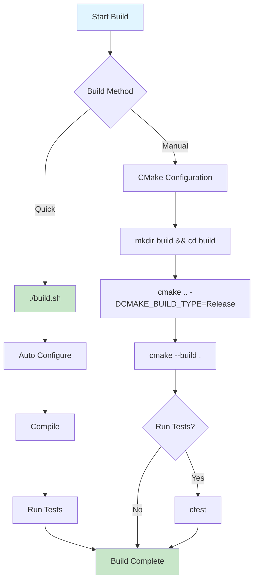
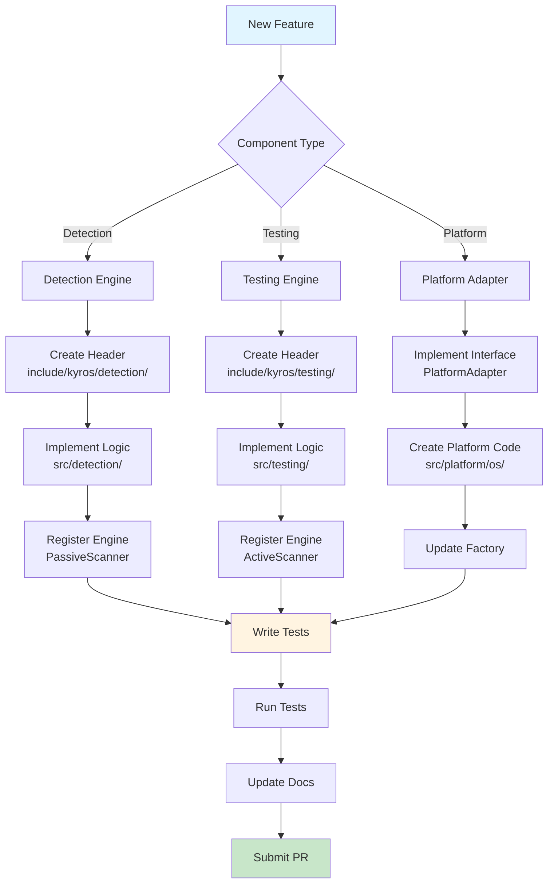

# Kyros Development Guide

## Build System



### Requirements

- CMake 3.15 or later
- C++17 compatible compiler (GCC 7+, Clang 5+, MSVC 2017+)
- Standard POSIX environment (macOS, Linux)

### Building

```bash
# Full build with tests (recommended)
./build.sh

# Build only (no tests)
mkdir build && cd build
cmake -DCMAKE_BUILD_TYPE=Release ..
make

# Build with debugging symbols
cmake -DCMAKE_BUILD_TYPE=Debug ..
make
```

### Build Options

| Option | Description | Default |
|--------|-------------|---------|
| `BUILD_SHARED_LIBS` | Build shared libraries | OFF |
| `BUILD_DAEMON` | Build daemon service mode | ON |
| `BUILD_TESTS` | Build test suite | ON |
| `BUILD_EXAMPLES` | Build example programs | ON |
| `ENABLE_CONTAINERS` | Enable Docker/Kubernetes support | ON |
| `ENABLE_MANAGEMENT_SERVER` | Enable management server client | ON |

Example:
```bash
cmake .. \
    -DCMAKE_BUILD_TYPE=Release \
    -DBUILD_DAEMON=ON \
    -DBUILD_TESTS=ON \
    -DBUILD_EXAMPLES=ON
```

## Project Structure

```
kyros/
├── include/kyros/          # Public headers
│   ├── scanner.hpp         # Main scanner interface
│   ├── config.hpp          # Configuration structures
│   ├── types.hpp           # Common type definitions
│   ├── detection/          # Detection engine interfaces
│   ├── testing/            # Testing engine interfaces
│   ├── platform/           # Platform abstraction
│   └── reporting/          # Reporter interfaces
├── src/                    # Implementation files
│   ├── scanner.cpp         # Scanner orchestration
│   ├── detection/          # Detection engines
│   ├── testing/            # Testing engines
│   ├── platform/           # Platform implementations
│   └── reporting/          # Report generators
├── tests/                  # Test suite
│   └── unit/               # Unit tests
├── third_party/            # External dependencies
└── docs/                   # Documentation
```

## Testing

### Running Tests

```bash
# Run all tests
cd build && ctest --output-on-failure

# Run with verbose output
ctest --verbose

# Run specific test suite
ctest -R test_scanner

# Run tests in parallel
ctest -j4

# Generate coverage report
../build.sh Coverage --coverage
```

### Writing Tests

Tests use Google Test framework:

```cpp
#include <gtest/gtest.h>
#include <kyros/config.hpp>

TEST(ConfigTest, ValidityCheck) {
    // Arrange
    kyros::Config config;

    // Act & Assert
    EXPECT_TRUE(config.is_valid());
}

// Test fixture for complex tests
class ScannerTest : public ::testing::Test {
protected:
    void SetUp() override {
        // Setup code
    }

    void TearDown() override {
        // Cleanup code
    }
};

TEST_F(ScannerTest, BasicScan) {
    // Test using fixture
}
```

For comprehensive testing documentation, see [TESTING.md](TESTING.md).

## Adding Features



### New Detection Engine

1. Create header in `include/kyros/detection/`:
```cpp
class MyDetectionEngine : public DetectionEngine {
public:
    std::string name() const override { return "MyEngine"; }
    std::vector<Candidate> detect() override;
};
```

2. Implement in `src/detection/`:
```cpp
std::vector<Candidate> MyDetectionEngine::detect() {
    std::vector<Candidate> candidates;
    // Detection logic
    return candidates;
}
```

3. Register in `PassiveScanner::initialize_engines()`:
```cpp
auto engine = std::make_unique<MyDetectionEngine>();
engine->set_platform_adapter(platform_);
engines_.push_back(std::move(engine));
```

### New Testing Engine

1. Create header in `include/kyros/testing/`:
```cpp
class MyTestingEngine : public TestingEngine {
public:
    std::string name() const override { return "MyTester"; }
    std::optional<MCPServer> test(const Candidate& candidate) override;
};
```

2. Implement test logic:
```cpp
std::optional<MCPServer> MyTestingEngine::test(const Candidate& candidate) {
    // Protocol handshake
    // Return MCPServer on success, nullopt on failure
}
```

3. Register in `ActiveScanner::initialize_engines()`.

### New Platform Support

1. Implement `PlatformAdapter` interface for target OS
2. Implement `Process` interface for process management
3. Update `create_platform_adapter()` factory function
4. Add platform-specific system call implementations

## Code Style

### Naming Conventions

- **Classes:** PascalCase (`ServerInterrogator`)
- **Functions:** snake_case (`detect_servers()`)
- **Variables:** snake_case (`server_list`)
- **Constants:** UPPER_SNAKE_CASE (`MAX_SERVERS`)
- **Private members:** trailing underscore (`platform_`)

### File Organization

- One class per file
- Header guards: `KYROS_COMPONENT_NAME_HPP`
- Forward declarations in headers
- Implementation details in `.cpp` files

### Error Handling

- Use exceptions for exceptional conditions
- Return `std::optional` for expected failures
- Log errors to results structures
- Never silently fail

Example:
```cpp
std::optional<MCPServer> test(const Candidate& candidate) {
    try {
        // Test logic
        return server;
    } catch (const std::exception& e) {
        // Log error, return nullopt
        return std::nullopt;
    }
}
```

## Dependencies

### Required (Automatically Fetched)

These dependencies are automatically downloaded and built via CMake FetchContent:

- **nlohmann/json 3.11.0+** - JSON parsing and serialization
- **CLI11 2.3.0+** - Command-line argument parsing
- **Google Test 1.14.0+** - Testing framework (when BUILD_TESTS=ON)

### Optional

- **SQLite3** - Required for daemon mode (when BUILD_DAEMON=ON)
- **lcov/gcov** - Required for code coverage reports
- **gRPC** - Required for management server client (when ENABLE_MANAGEMENT_SERVER=ON)

### Platform-Specific

- **macOS:** libproc (system library for process introspection)
- **Linux:** procfs (planned, standard /proc filesystem access)
- **Windows:** Windows API (planned, system libraries)

### Adding Dependencies

Use CMake FetchContent for header-only libraries:

```cmake
FetchContent_Declare(
    library_name
    URL https://github.com/user/library/archive/version.tar.gz
    URL_HASH SHA256=...
)
FetchContent_MakeAvailable(library_name)
```

## Debugging

### Verbose Mode

Enable detailed logging during execution:
```bash
./build/kyros --mode active --verbose
```

### Debug Build

Build with debugging symbols and no optimizations:
```bash
./build.sh Debug

# Or manually
mkdir build && cd build
cmake .. -DCMAKE_BUILD_TYPE=Debug
cmake --build .
```

### Using Debuggers

**macOS (lldb):**
```bash
lldb ./build/kyros
(lldb) run --mode active
(lldb) breakpoint set --name main
(lldb) continue
```

**Linux (gdb):**
```bash
gdb ./build/kyros
(gdb) run --mode active
(gdb) break main
(gdb) continue
```

### Memory Debugging

**Using Address Sanitizer (ASan):**
```bash
cmake .. \
    -DCMAKE_BUILD_TYPE=Debug \
    -DCMAKE_CXX_FLAGS="-fsanitize=address,undefined -fno-omit-frame-pointer" \
    -DCMAKE_EXE_LINKER_FLAGS="-fsanitize=address,undefined"
cmake --build .

ASAN_OPTIONS=detect_leaks=1 ./build/kyros --mode active
```

**Using Valgrind (Linux):**
```bash
valgrind --leak-check=full --show-leak-kinds=all ./build/kyros --mode active
```

### Common Issues

**Process detection not working:**
- Check platform adapter implementation
- Verify system API availability
- Test with elevated privileges

**Interrogation timing out:**
- Increase timeout configuration
- Check server response time
- Verify transport connectivity

**Tests failing:**
- Rebuild completely: `rm -rf build && ./build.sh`
- Check for dependency version conflicts
- Verify platform compatibility

## Contributing

### Before Submitting

1. Run full test suite: `ctest`
2. Verify build: `./build.sh`
3. Check code style consistency
4. Update documentation as needed
5. Add tests for new functionality

### Pull Request Guidelines

- Clear description of changes
- Reference related issues
- Include test coverage
- Update relevant documentation
- Follow existing code patterns

## Performance Optimization

### Profiling

Use standard profiling tools:

```bash
# macOS
instruments -t "Time Profiler" ./build/kyros --mode active

# Linux
valgrind --tool=callgrind ./build/kyros --mode active
```

### Optimization Targets

- Process enumeration (currently O(n))
- JSON parsing (consider streaming for large responses)
- Network scanning (parallel socket checks)
- Candidate deduplication (consider hash-based approach)

## Platform Notes

### macOS

- Uses `proc_listallpids()` for process enumeration
- Requires `libproc` for process introspection
- Environment variable access limited without root
- File descriptor inspection via `proc_pidinfo()`

### Linux (Planned)

- Will use `/proc` filesystem
- Standard POSIX process APIs
- Better environment variable access
- Standard file descriptor inspection

### Windows (Planned)

- Will use Windows API
- Process enumeration via `CreateToolhelp32Snapshot`
- Different pipe mechanisms
- Registry configuration detection
