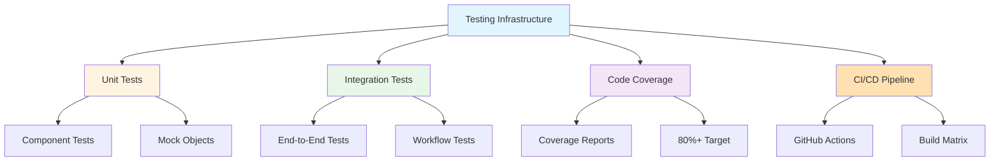
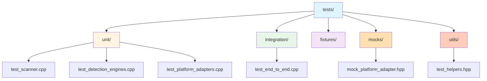
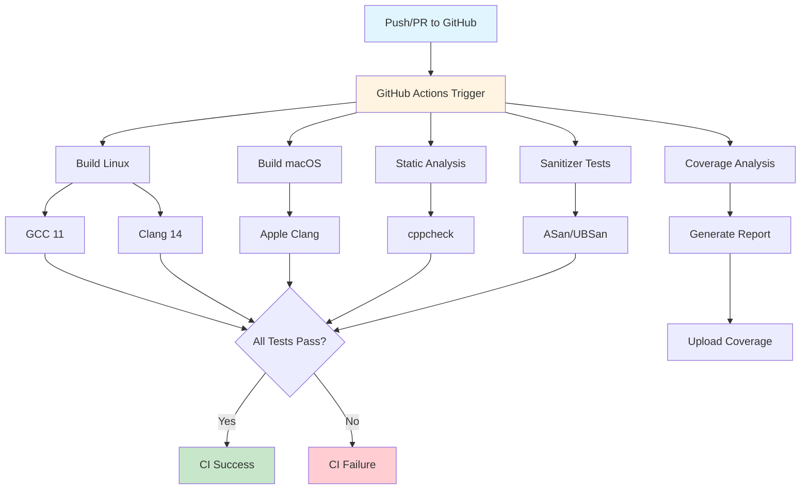

# Kyros Testing Guide

This document describes the comprehensive testing infrastructure for the Kyros project.

## Table of Contents

- [Overview](#overview)
- [Quick Start](#quick-start)
- [Test Organization](#test-organization)
- [Running Tests](#running-tests)
- [Writing Tests](#writing-tests)
- [Code Coverage](#code-coverage)
- [Continuous Integration](#continuous-integration)
- [Advanced Testing](#advanced-testing)

## Overview



Kyros uses **Google Test** (gtest/gmock) as its testing framework, providing:

- **Unit tests** for individual components
- **Integration tests** for end-to-end workflows
- **Mock objects** for controlled testing
- **Code coverage** tracking with lcov/gcov
- **CI/CD integration** via GitHub Actions
- **Sanitizers** (ASan, UBSan) for memory safety

## Quick Start

### Build and Run All Tests

```bash
# Build with tests enabled (default)
./build.sh --test

# Or manually
mkdir build && cd build
cmake .. -DBUILD_TESTS=ON
cmake --build .
ctest --output-on-failure
```

### Run Specific Tests

```bash
cd build

# List all tests
ctest -N

# Run specific test
ctest -R test_interrogator

# Run tests matching pattern
ctest -R detection

# Verbose output
ctest --verbose
```

### Generate Coverage Report

```bash
# Build with coverage instrumentation
./build.sh Coverage --coverage

# View report
open build/coverage/html/index.html  # macOS
xdg-open build/coverage/html/index.html  # Linux
```

## Test Organization



**Directory Structure:**
```
tests/
├── unit/                  # Unit tests for individual components
│   ├── test_scanner.cpp              # ServerInterrogator tests
│   ├── test_detection_engines.cpp    # Detection engine tests
│   ├── test_platform_adapters.cpp    # Platform adapter tests
│   ├── test_rulepack.cpp             # Rulepack tests
│   └── test_evidence.cpp             # Evidence tests
├── integration/           # Integration and end-to-end tests
│   └── test_end_to_end.cpp           # Full pipeline tests
├── fixtures/              # Test data and fixtures
├── mocks/                 # Mock objects
│   └── mock_platform_adapter.hpp     # Platform adapter mock
└── utils/                 # Test utilities
    └── test_helpers.hpp              # Helper functions
```

## Running Tests

### Basic Test Execution

```bash
# Run all tests
cd build && ctest

# Run with verbose output
ctest --verbose

# Run with output on failure only
ctest --output-on-failure

# Run tests in parallel (4 jobs)
ctest -j4
```

### Test Filtering

```bash
# Run tests by label
ctest -L unit           # Unit tests only
ctest -L integration    # Integration tests only

# Run specific test by name
ctest -R test_scanner

# Exclude tests
ctest -E integration
```

### Test Debugging

```bash
# Run a single test binary directly
./test_interrogator

# Run with gtest filters
./test_interrogator --gtest_filter=ServerInterrogatorTest.*

# List available tests
./test_interrogator --gtest_list_tests

# Repeat tests to catch flaky failures
./test_interrogator --gtest_repeat=10
```

## Writing Tests

### Unit Test Example

```cpp
#include <gtest/gtest.h>
#include <kyros/your_component.hpp>
#include "test_helpers.hpp"

using namespace kyros::test;

// Test fixture
class MyComponentTest : public ::testing::Test {
protected:
    void SetUp() override {
        // Setup code before each test
    }

    void TearDown() override {
        // Cleanup code after each test
    }

    // Test data members
};

// Test case
TEST_F(MyComponentTest, BasicFunctionality) {
    // Arrange
    auto component = create_test_component();

    // Act
    auto result = component.do_something();

    // Assert
    EXPECT_EQ(result, expected_value);
    ASSERT_TRUE(result.is_valid());
}

// Parameterized test
class MyParameterizedTest : public ::testing::TestWithParam<int> {};

TEST_P(MyParameterizedTest, WorksWithDifferentValues) {
    int value = GetParam();
    // Test with different parameter values
}

INSTANTIATE_TEST_SUITE_P(
    MyTestSuite,
    MyParameterizedTest,
    ::testing::Values(1, 2, 3, 5, 8)
);
```

### Using Test Helpers

```cpp
#include "test_helpers.hpp"

TEST(ExampleTest, UseHelpers) {
    // Create test MCP server
    auto server = kyros::test::create_test_server("my-server", "stdio");

    // Create test evidence
    auto evidence = kyros::test::create_test_evidence(
        "process_name", "node", 0.9
    );

    // Create JSON-RPC request
    auto request = kyros::test::create_jsonrpc_request("tools/list", 1);
}
```

### Using Mocks

```cpp
#include "mocks/mock_platform_adapter.hpp"

TEST(PlatformTest, UseMockAdapter) {
    MockPlatformAdapter adapter;

    // Set expectations
    EXPECT_CALL(adapter, get_all_processes())
        .WillOnce(Return(test_processes));

    // Set test data
    adapter.set_test_processes(test_processes);

    // Use the mock
    auto processes = adapter.get_all_processes();
}
```

### Adding New Tests

1. Create test file in `tests/unit/` or `tests/integration/`
2. Add to `tests/CMakeLists.txt`:

```cmake
add_kyros_test(test_my_component
    SOURCES unit/test_my_component.cpp
)
```

## Code Coverage

### Generate Coverage Report

```bash
# Method 1: Using build script
./build.sh Coverage --coverage

# Method 2: Manual
mkdir build && cd build
cmake .. -DCMAKE_BUILD_TYPE=Coverage -DBUILD_TESTS=ON
cmake --build .
cmake --build . --target coverage
```

### View Coverage Report

```bash
# HTML report
open build/coverage/html/index.html

# Terminal summary
lcov --summary build/coverage/coverage_filtered.info
```

### Coverage Targets

- **Overall target**: 80%+ coverage
- **Critical components**: 90%+ coverage
  - Detection engines
  - Testing engines
  - Server interrogator

### Excluding Files from Coverage

Edit `.lcov_exclude` or modify coverage target in `CMakeLists.txt`:

```cmake
COMMAND lcov --remove coverage.info
    '/usr/*'              # System headers
    '*/third_party/*'     # Dependencies
    '*/tests/*'           # Test code
    --output-file coverage_filtered.info
```

## Continuous Integration



### GitHub Actions Workflows

The project includes comprehensive CI workflows in `.github/workflows/ci.yml`:

#### Build Matrix
- **Linux**: GCC 11, Clang 14
- **macOS**: Latest Apple Clang
- **Build types**: Release, Debug, Coverage

#### CI Jobs

1. **build-linux** - Build and test on Ubuntu
2. **build-macos** - Build and test on macOS
3. **coverage** - Generate code coverage report
4. **static-analysis** - Run cppcheck
5. **sanitizers** - Run tests with ASan/UBSan

### Running CI Locally

```bash
# Linux build
./build.sh Release --test --clean

# Coverage build
./build.sh Coverage --coverage

# With sanitizers (requires Clang)
mkdir build && cd build
cmake .. \
    -DCMAKE_BUILD_TYPE=Debug \
    -DCMAKE_CXX_FLAGS="-fsanitize=address,undefined" \
    -DCMAKE_EXE_LINKER_FLAGS="-fsanitize=address,undefined"
cmake --build .
ASAN_OPTIONS=detect_leaks=1 ctest
```

## Advanced Testing

### Memory Leak Detection

```bash
# Using Valgrind (Linux)
valgrind --leak-check=full ./build/test_scanner

# Using ASan
export ASAN_OPTIONS=detect_leaks=1
./build/test_scanner
```

### Performance Testing

```bash
# Run tests with timing
ctest --verbose | grep "Test.*sec"

# Profile specific test
time ./build/test_scanner
```

### Test Data Fixtures

Place test data in `tests/fixtures/`:

```cpp
TEST(MyTest, LoadFixture) {
    std::ifstream file("../fixtures/test_data.json");
    // Use fixture data
}
```

### Debugging Failed Tests

```bash
# Run test in debugger
lldb ./build/test_scanner
(lldb) run

# Or with gdb
gdb ./build/test_scanner
(gdb) run

# Get backtrace on failure
(gdb) bt
```

## Best Practices

### Test Naming

- Use descriptive test names: `TEST(ComponentTest, DescribesWhatIsTested)`
- Group related tests in test fixtures
- Use clear assertion messages

### Test Structure

Follow AAA pattern:
```cpp
TEST(MyTest, Example) {
    // Arrange - Set up test data
    auto component = setup_component();

    // Act - Execute the behavior
    auto result = component.perform_action();

    // Assert - Verify the outcome
    EXPECT_EQ(result, expected);
}
```

### Assertions

- Use `EXPECT_*` for non-fatal assertions
- Use `ASSERT_*` when continuation doesn't make sense
- Prefer specific matchers: `EXPECT_EQ`, `EXPECT_TRUE`, `EXPECT_THAT`

### Test Independence

- Each test should be independent
- Don't rely on test execution order
- Clean up resources in `TearDown()`

### Mock Usage

- Mock external dependencies only
- Don't mock the system under test
- Use mocks to control test conditions

## Troubleshooting

### Tests Won't Build

```bash
# Clean rebuild
./build.sh --clean --test

# Check CMake configuration
cd build && cmake .. -DBUILD_TESTS=ON
```

### Tests Fail Intermittently

- Check for race conditions
- Use `--gtest_repeat=100` to reproduce
- Review resource cleanup in tests

### Coverage Report Empty

```bash
# Ensure Coverage build type
cmake .. -DCMAKE_BUILD_TYPE=Coverage

# Verify lcov is installed
which lcov genhtml
```

## Resources

- [Google Test Documentation](https://google.github.io/googletest/)
- [Google Mock for Dummies](https://google.github.io/googletest/gmock_for_dummies.html)
- [CMake Testing](https://cmake.org/cmake/help/latest/manual/ctest.1.html)
- [LCOV Documentation](http://ltp.sourceforge.net/coverage/lcov.php)

## Contributing Tests

When adding new features:

1. Write tests first (TDD approach recommended)
2. Ensure all tests pass locally
3. Verify coverage doesn't decrease
4. Run sanitizers before submitting PR
5. Document complex test scenarios

## Getting Help

- Check existing tests for examples
- Review test helpers in `tests/utils/`
- Ask in project discussions
- File issues for test infrastructure problems
