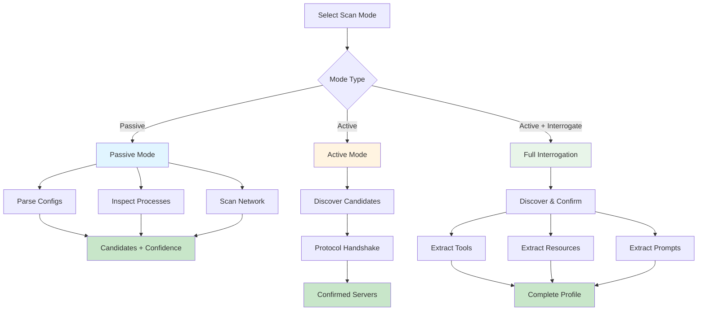
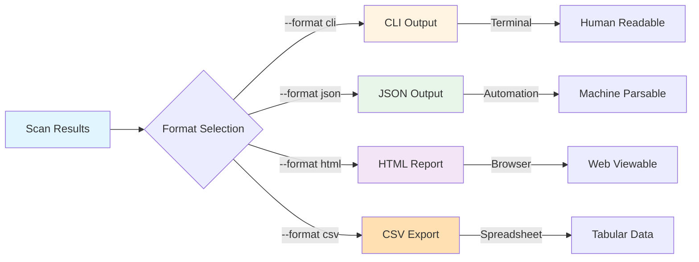

# Kyros Usage Guide

## Installation

### Building from Source

```bash
# Clone the repository
git clone https://github.com/your-org/kyros.git
cd kyros

# Build using the provided script
./build.sh

# Binary will be created at build/kyros
./build/kyros --help
```

### System Requirements

**Current Platform Support:**
- macOS 10.15 or later (fully supported)

**Planned Platform Support:**
- Linux (Ubuntu 20.04+, Fedora, Arch)
- Windows 10/11

**Build Requirements:**
- C++17 compatible compiler (GCC 7+, Clang 5+, Apple Clang 10+)
- CMake 3.15 or later
- Git for version control

**Optional:**
- lcov/gcov for code coverage
- SQLite3 for daemon mode (planned)

## Command Line Interface

### Basic Usage

```bash
# Passive scan only (discovery without confirmation)
./build/kyros

# Active scan (discover and confirm)
./build/kyros --mode active

# Full scan with interrogation
./build/kyros --mode active --interrogate

# Note: If installed system-wide, you can omit ./build/ prefix
# kyros --mode active
```

### Options

| Option | Description | Default |
|--------|-------------|---------|
| `--mode <mode>` | Scan mode: passive, active | passive |
| `--interrogate` | Extract server capabilities | false |
| `--format <fmt>` | Output format: cli, json, html, csv | cli |
| `--output <file>` | Write output to file | stdout |
| `--timeout <ms>` | Probe timeout in milliseconds | 5000 |
| `--verbose` | Enable verbose logging | false |
| `--version` | Display version information | - |
| `--help` | Show help message | - |

## Scan Modes



### Passive Mode

Discovers potential MCP servers without active testing through static analysis and system inspection.

**Detection Methods:**
- Configuration file parsing (Claude Desktop, custom configs)
- Running process inspection with parent process analysis
- Network listener enumeration on localhost

**Output:**
- List of candidate servers with evidence trails
- Confidence scores based on aggregated evidence
- No active server interaction or confirmation

**Use Case:** Rapid discovery with minimal system impact and no server communication.

```bash
./build/kyros --mode passive --format json -o candidates.json
```

### Active Mode

Confirms candidate servers by performing MCP protocol handshakes via appropriate transports.

**Process:**
1. Discovers candidates through passive detection (if not provided)
2. Tests each candidate using protocol-appropriate transport (stdio/HTTP)
3. Validates servers via MCP initialize request/response exchange

**Output:**
- Confirmed MCP servers only (failed tests excluded)
- Protocol version and declared capabilities
- Server identification metadata

**Use Case:** Definitive verification of MCP servers with protocol validation.

```bash
./build/kyros --mode active --timeout 10000
```

### Active with Interrogation

Performs complete server analysis by confirming servers and extracting detailed capability information.

**Additional Data Extracted:**
- Available tools with complete input schemas
- Available resources with metadata and MIME types
- Resource templates with URI patterns and parameters
- Available prompts with argument specifications

**Output:**
- All active mode information (server confirmation)
- Detailed capability listings with parameter definitions
- Tool input schema specifications
- Resource template URI patterns

**Use Case:** Comprehensive MCP server inventory with complete capability analysis.

```bash
./build/kyros --mode active --interrogate --format html -o report.html
```

## Output Formats



### CLI (Default)

Human-readable terminal output with formatted tables and summaries for interactive use.

```bash
./build/kyros --mode active
```

### JSON

Machine-parsable structured data suitable for automation, integration, and programmatic processing.

```bash
./build/kyros --mode active --format json -o scan-results.json
```

**Structure:**
```json
{
  "scan_timestamp": "2024-12-29T12:00:00Z",
  "scan_duration_seconds": 2.5,
  "passive_results": { ... },
  "active_results": { ... },
  "errors": []
}
```

### HTML

Web-viewable report with styled formatting for sharing and documentation purposes.

```bash
./build/kyros --mode active --interrogate --format html -o report.html
```

### CSV

Spreadsheet-compatible tabular data for analysis in Excel, Google Sheets, or similar tools.

```bash
./build/kyros --mode active --format csv -o servers.csv
```

## Examples

### Find All MCP Servers

```bash
./build/kyros --mode active --format json -o mcp-inventory.json
```

### Analyze Claude Desktop Configuration

```bash
# Passive scan to see configured servers
./build/kyros

# Confirm they are running
./build/kyros --mode active
```

### Extract Server Capabilities

```bash
./build/kyros --mode active --interrogate --format html -o capabilities.html
```

### Quick Network Scan

```bash
# Find HTTP MCP servers on localhost
./build/kyros --mode active --timeout 2000
```

### Verbose Debugging

```bash
./build/kyros --mode active --interrogate --verbose
```

## Configuration Files

### Supported Formats

Kyros automatically detects MCP servers from:

**Claude Desktop Configuration:**
- macOS: `~/Library/Application Support/Claude/claude_desktop_config.json`
- Linux: `~/.config/Claude/claude_desktop_config.json`

**Custom Configuration:**
Additional paths can be specified via passive scan configuration.

### Configuration File Format

```json
{
  "mcpServers": {
    "filesystem": {
      "command": "npx",
      "args": ["-y", "@modelcontextprotocol/server-filesystem", "/path/to/allowed/files"],
      "env": {
        "CUSTOM_VAR": "value"
      }
    },
    "github": {
      "command": "npx",
      "args": ["-y", "@modelcontextprotocol/server-github"],
      "env": {
        "GITHUB_PERSONAL_ACCESS_TOKEN": "token"
      }
    },
    "http-server": {
      "url": "http://localhost:3000"
    }
  }
}
```

## Exit Codes

| Code | Meaning |
|------|---------|
| 0 | Success, servers found |
| 1 | Success, no servers found |
| 2 | Error during execution |

## Performance Considerations

### Timeout Values

- Default timeout: 5000ms
- Minimum recommended: 1000ms
- Maximum allowed: 60000ms

Lower timeouts reduce scan time but may miss slow-starting servers.

### Interrogation Limits

Interrogation has built-in limits to prevent overwhelming responses:
- Max tools: 100
- Max resources: 100
- Max prompts: 50

These can be adjusted via configuration.

## Troubleshooting

### No Servers Found

**Possible Causes:**
- No MCP servers running
- Servers using non-standard configurations
- Insufficient permissions for process inspection

**Solutions:**
- Verify MCP servers are running
- Check Claude Desktop is active
- Run with elevated privileges if needed

### Timeout Errors

**Possible Causes:**
- Servers slow to initialize
- Network latency (HTTP servers)
- Resource constraints

**Solutions:**
- Increase timeout: `--timeout 10000`
- Check server logs for issues
- Verify server is responsive

### Permission Errors

**Possible Causes:**
- Restricted process inspection (macOS)
- File system permissions

**Solutions:**
- Some platform features require elevated privileges
- Process environment variables may not be accessible without root

## Advanced Usage

### Programmatic Usage

Kyros can be integrated into automation workflows:

```bash
# Generate JSON report for processing
./build/kyros --mode active --interrogate --format json | jq '.active_results.confirmed_servers'

# Check if specific server is running
./build/kyros --mode active --format json | jq -e '.active_results.servers_confirmed_count > 0'

# Exit code based integration
if ./build/kyros --mode active --format json > /dev/null 2>&1; then
    echo "MCP servers found"
else
    echo "No MCP servers found or error occurred"
fi
```

### Filtering Results

Use `jq` or similar tools to filter JSON output:

```bash
# Find servers with specific tools
./build/kyros --mode active --interrogate --format json | \
  jq '.active_results.confirmed_servers[] | select(.tools[]?.name == "read_file")'

# List all available tools across all servers
./build/kyros --mode active --interrogate --format json | \
  jq '.active_results.confirmed_servers[].tools[].name' | sort -u

# Count servers by transport type
./build/kyros --mode active --format json | \
  jq '.active_results.confirmed_servers | group_by(.transport_type) | map({transport: .[0].transport_type, count: length})'
```
